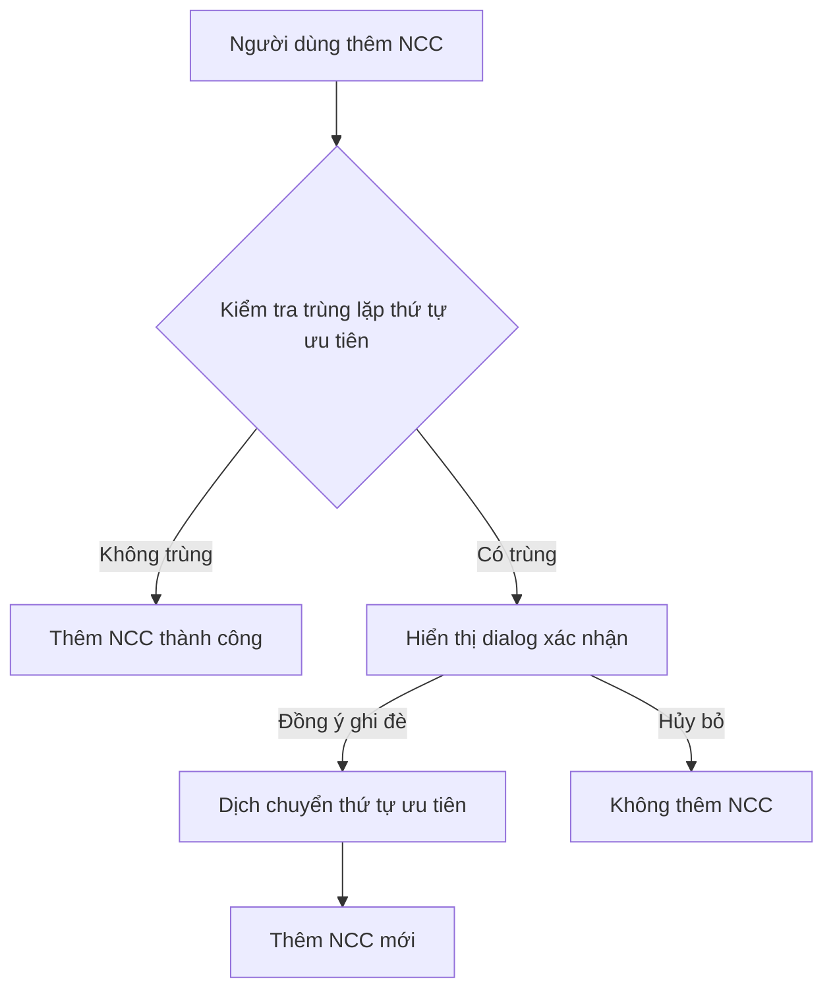

# 🏢 Hệ thống Quản lý Nhà Cung Cấp - Thứ tự Ưu tiên

## 📋 Mô tả

Hệ thống quản lý nhà cung cấp với tính năng kiểm tra và xử lý trùng lặp thứ tự ưu tiên theo yêu cầu:

> **Yêu cầu:** Khi thêm 2 NCC cùng có thứ tự ưu tiên là 1, hệ thống sẽ hỏi ghi đè hay không với thông báo *"Đã tồn tại thứ tự ưu tiên ứng với miền ưu tiên này, bạn có muốn ghi đè ?"*. Nếu ghi đè thì thứ tự ưu tiên các nhà cung cấp dịch chuyển tăng thêm 1.

## 🚀 Tính năng chính

### ✅ Đã hoàn thành
1. **Kiểm tra trùng lặp thứ tự ưu tiên** - Tự động phát hiện khi có NCC cùng thứ tự ưu tiên trong cùng miền
2. **Dialog xác nhận ghi đè** - Hiển thị thông báo xác nhận với thông tin chi tiết
3. **Dịch chuyển thứ tự ưu tiên** - Tự động tăng thứ tự ưu tiên của các NCC bị ảnh hưởng
4. **Quản lý theo miền** - Hỗ trợ phân loại NCC theo miền ưu tiên (điện tử, thời trang, thực phẩm, v.v.)
5. **Giao diện người dùng** - UI hiện đại, responsive với modal xác nhận

## 📁 Cấu trúc file

```
/workspace/
├── supplier-management.js    # Module xử lý logic NCC
├── supplier-ui.html         # Giao diện người dùng
└── README.md               # Tài liệu hướng dẫn
```

## 🔧 Cách sử dụng

### 1. Mở giao diện
```bash
# Mở file supplier-ui.html trong trình duyệt
open supplier-ui.html
```

### 2. Thêm nhà cung cấp
1. Điền thông tin NCC: Tên, thứ tự ưu tiên, miền, giá nhập
2. Click "Thêm Nhà Cung Cấp"
3. Nếu trùng thứ tự ưu tiên → hiển thị dialog xác nhận

### 3. Xử lý trùng lặp
- **Đồng ý ghi đè**: NCC mới sẽ có thứ tự ưu tiên như mong muốn, các NCC khác bị dịch chuyển
- **Hủy bỏ**: Không thêm NCC mới, giữ nguyên thứ tự hiện tại

## 💻 API sử dụng

### SupplierManager Class

```javascript
const manager = new SupplierManager();

// Thêm NCC mới
const result = await manager.addSupplier({
    name: 'NCC ABC',
    priority: 1,
    domain: 'electronics',
    importPrice: 100000
});

// Kiểm tra trùng lặp
const duplicate = manager.checkPriorityDuplicate(1, 'electronics');

// Cập nhật thứ tự ưu tiên
const updateResult = await manager.updateSupplierPriority('SUP_123', 2);
```

### Các method chính

| Method | Mô tả |
|--------|-------|
| `addSupplier(data)` | Thêm NCC mới với kiểm tra trùng lặp |
| `checkPriorityDuplicate(priority, domain)` | Kiểm tra trùng lặp thứ tự ưu tiên |
| `shiftPriorities(fromPriority, domain)` | Dịch chuyển thứ tự ưu tiên |
| `updateSupplierPriority(id, newPriority)` | Cập nhật thứ tự ưu tiên |
| `getSuppliersByDomain(domain)` | Lấy danh sách NCC theo miền |

## 🎯 Luồng xử lý



## 📊 Ví dụ thực tế

### Tình huống 1: Không có trùng lặp
```javascript
// Thêm NCC đầu tiên
await manager.addSupplier({
    name: 'NCC A',
    priority: 1,
    domain: 'electronics',
    importPrice: 100000
});
// ✅ Thêm thành công, không có dialog
```

### Tình huống 2: Có trùng lặp - Đồng ý ghi đè
```javascript
// Đã có NCC A với priority = 1
// Thêm NCC B cũng với priority = 1
await manager.addSupplier({
    name: 'NCC B',
    priority: 1,
    domain: 'electronics',
    importPrice: 95000
});
// ⚠️ Hiển thị dialog xác nhận
// ✅ Nếu đồng ý: NCC A → priority = 2, NCC B → priority = 1
```

### Tình huống 3: Có trùng lặp - Hủy bỏ
```javascript
// User chọn "Hủy bỏ" trong dialog
// ❌ Không thêm NCC B, giữ nguyên NCC A priority = 1
```

## 🎨 Giao diện

### Modal xác nhận ghi đè
- **Tiêu đề**: "Xác nhận Ghi đè Thứ tự Ưu tiên"
- **Thông tin NCC hiện tại**: Tên, thứ tự ưu tiên, miền, giá nhập
- **Cảnh báo**: Ảnh hưởng đến các NCC khác
- **Lưu ý**: Chi tiết về việc dịch chuyển thứ tự
- **Nút chọn**: "Đồng ý Ghi đè" / "Hủy bỏ"

### Danh sách NCC
- Hiển thị theo miền ưu tiên
- Sắp xếp theo thứ tự ưu tiên tăng dần
- Thông tin: Tên, thứ tự ưu tiên, giá nhập, ngày tạo

## 🔍 Test Cases

### Test Case 1: Thêm NCC không trùng lặp
```javascript
// Input: NCC với priority chưa tồn tại
// Expected: Thêm thành công, không có dialog
```

### Test Case 2: Thêm NCC trùng lặp - Đồng ý ghi đè
```javascript
// Input: NCC với priority đã tồn tại, user chọn "Đồng ý"
// Expected: NCC mới được thêm, các NCC cũ bị dịch chuyển
```

### Test Case 3: Thêm NCC trùng lặp - Hủy bỏ
```javascript
// Input: NCC với priority đã tồn tại, user chọn "Hủy bỏ"
// Expected: Không thêm NCC mới, giữ nguyên trạng thái
```

### Test Case 4: Khác miền ưu tiên
```javascript
// Input: NCC với priority trùng nhưng khác miền
// Expected: Thêm thành công, không có dialog
```

## 🚀 Chạy demo

1. Mở `supplier-ui.html` trong trình duyệt
2. Thêm NCC đầu tiên với priority = 1
3. Thêm NCC thứ hai cũng với priority = 1
4. Quan sát dialog xác nhận xuất hiện
5. Test cả 2 lựa chọn: "Đồng ý ghi đè" và "Hủy bỏ"

## 🔧 Tùy chỉnh

### Thêm miền ưu tiên mới
```html
<select id="domain" name="domain">
    <option value="default">Mặc định</option>
    <option value="electronics">Điện tử</option>
    <!-- Thêm option mới ở đây -->
    <option value="new_domain">Miền mới</option>
</select>
```

### Thay đổi thông báo dialog
```javascript
const message = `Thông báo tùy chỉnh: Đã tồn tại thứ tự ưu tiên ${priority}...`;
```

## 📞 Hỗ trợ

Nếu có vấn đề gì trong quá trình sử dụng, hãy kiểm tra:

1. **Console log**: Mở F12 → Console để xem lỗi
2. **Network tab**: Kiểm tra việc load file JavaScript
3. **Compatibility**: Đảm bảo trình duyệt hỗ trợ ES6+ (async/await)

---

*Tài liệu được tạo bởi AI Assistant - Cập nhật lần cuối: $(date)*